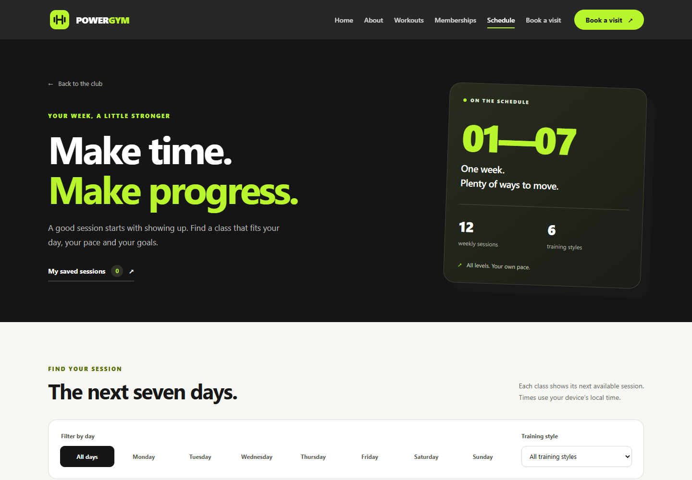

# PowerGym

Многостраничный сайт вымышленного фитнес-клуба: знакомство с клубом, расписание занятий и запись на тренировку. Интерфейс написан на HTML, CSS и JavaScript без UI-фреймворков. Vite отвечает за разработку и сборку; готовый сайт не требует зависимостей во время работы в браузере.



## Что можно посмотреть

- **Главная — `index.html`:** направления тренировок с подробностями в диалоговом окне, тренеры, отзывы, FAQ и тарифы с переключением месячной и годовой оплаты.
- **Расписание — `schedule.html`:** фильтры по дню недели и направлению, количество найденных занятий, состояние без результатов и сброс фильтров. Сохранённые записи можно отменить.
- **Запись — `booking.html`:** выбор занятия и тарифа, проверка введённых данных, просмотр заявки перед подтверждением и результат записи. Данные выбора передаются между страницами через параметры URL.

Запись сохраняется в текущем браузере и остаётся после обновления страницы. Повторная запись на одно занятие и выбор прошедшей даты проверяются отдельно. В хранилище попадают сведения о выбранном занятии и тарифе, но не имя и email.

В интерфейсе предусмотрены мобильное меню, управление с клавиатуры, видимый фокус, подписи элементов формы, сообщения о результате действий и учёт настройки уменьшения анимации.

## Запуск

Рекомендуются Node.js 24 LTS и npm. Версия Node закреплена в `.nvmrc`; минимальная версия для проекта — 22.12.0.

```sh
npm ci
npm run dev
```

Откройте `http://127.0.0.1:4173`. Команды запускаются из папки `Gym`, где находятся `package.json` и этот README.

Vite обновляет страницу при изменении исходников. Чтобы проверить готовую сборку, выполните:

```sh
npm run build
npm run preview
```

Предпросмотр готового сайта открывается на `http://127.0.0.1:4174`. Сборка находится в `dist/`; именно её содержимое нужно размещать на статическом хостинге. Адреса страниц остаются прежними: `index.html`, `schedule.html` и `booking.html`.

Открывайте сайт через локальный HTTP-сервер. Файлы в `dist/` создаются автоматически, поэтому изменения нужно вносить в исходники.

## Структура и решения

```text
Gym/
├── src/
│   ├── index.html              # главная
│   ├── schedule.html           # расписание
│   ├── booking.html            # запись
│   ├── partials/header.html    # единая шапка для всех страниц
│   └── assets/
│       ├── styles/
│       │   ├── base.css        # общие элементы и базовые стили
│       │   ├── components/     # шапка, диалог
│       │   └── pages/          # главная, расписание, запись
│       └── scripts/
│           ├── app.js          # общая точка входа
│           ├── components/    # меню, прокрутка, диалог тренировок
│           ├── data/catalog.js
│           ├── services/booking-storage.js
│           ├── utils/reveal.js
│           └── pages/         # отдельная логика каждой страницы
├── public/
│   ├── images/                 # фотографии и растровые изображения
│   └── icons/                  # SVG-иконки и favicon
├── scripts/
│   ├── shared-header.mjs        # общий шаблон и плагин Vite
│   ├── build.mjs                # вызов сборки для проверок
│   └── check.mjs                # проверка исходников и готового сайта
├── tests/                      # unit-тесты и браузерные сценарии
├── docs/screenshots/
├── dist/                       # готовый сайт; не хранится в Git
├── vite.config.js              # три HTML-точки входа и настройки Vite
├── vercel.json                 # настройки сборки на Vercel
├── .nvmrc                      # рекомендуемая версия Node.js
└── package.json
```

Шапка хранится в `src/partials/header.html`. Плагин в `scripts/shared-header.mjs` вставляет её во все страницы и при разработке, и во время сборки Vite. Пункты меню, их порядок и подписи одинаковы на главной, в расписании и в форме записи; ссылки на разделы главной работают с любой страницы. Чтобы изменить навигацию, достаточно отредактировать один файл. Общая шапка доступна и без JavaScript, а активная страница отмечается при обработке HTML.

`catalog.js` хранит расписание и тарифы, а также общие функции для дат и выбора занятий. `booking-storage.js` отвечает за версионированное хранилище записей и обработку ошибок чтения и записи. `app.js` подключает общие взаимодействия из модулей компонентов; логика главной, расписания и формы записи находится в `scripts/pages/`.

Стили разделены на базовые, общие компоненты и конкретные страницы. Vite собирает скрипты и CSS из `src/assets/` в `dist/assets/` с именами файлов, зависящими от содержимого. Фотографии из `public/images/` доступны по пути `/images/`, значки из `public/icons/` — по пути `/icons/`; эти файлы копируются в сборку без переименования. Для диалогов и FAQ используются браузерные элементы, для адаптивных сеток — CSS Grid и Flexbox. Node.js нужен для сборки, локального сервера и проверок; готовый сайт не требует сервера приложений.

## Проверки

```sh
npm run check
npm test
npm run test:e2e
```

Проверки синтаксиса охватывают JavaScript-модули. Тесты `node:test` проверяют работу с данными, датами и хранилищем, а также вставку общего шаблона шапки. Команда `npm run test:e2e` сначала создаёт сборку, затем запускает Playwright на production-предпросмотре Vite по адресу `http://127.0.0.1:4174`. Проверяются запись и отмена занятия, фильтры, клавиатура, адаптив, одинаковая навигация на всех страницах и положение шапки при задержанной загрузке JavaScript. Для браузерных тестов нужен установленный Microsoft Edge. Vite и Playwright являются зависимостями только для разработки.

## Публикация на Vercel

Для первой публикации импортируйте GitHub-репозиторий `Gym` в новый проект Vercel. Выберите корень самого репозитория, где находятся `package.json` и `vercel.json`, со следующими настройками:

| Параметр | Значение |
| --- | --- |
| Root Directory | `.` — корень репозитория |
| Framework Preset | `Vite` |
| Install Command | `npm ci` |
| Build Command | `npm run build` |
| Output Directory | `dist` |
| Node.js Version | `24.x` |

`vercel.json` задаёт параметры сборки; в панели остаётся проверить корневую папку и версию Node.js. Подробнее: [Vite на Vercel](https://vercel.com/docs/frameworks/frontend/vite) и [настройки сборки](https://vercel.com/docs/builds/configure-a-build). Это многостраничный сайт с отдельными HTML-файлами: общая переадресация всех адресов на главную не требуется.

После публикации проверьте главную, `/schedule.html` и `/booking.html`, переходы через меню и загрузку изображений. Добавьте полученный публичный адрес в описание GitHub-репозитория и резюме. Настройки в репозитории подготавливают сборку к размещению, но сами по себе не публикуют сайт.

## Границы демо

Сайт не подключён к серверу клуба. Записи не отправляются сотрудникам, письма не рассылаются, оплата не проводится. Сохранение работает только в текущем браузере; очистка его данных удаляет записи. Расписание и число мест — демонстрационные данные, общей синхронизации между посетителями нет.

Название клуба, имена, отзывы, контакты и тарифы используются как примеры. Фото находятся в `public/images/`, SVG-значки — в `public/icons/`. Источники новых изображений, запросы для их создания и инструкции по замене портретов описаны в [визуальных материалах](docs/assets.md).

## Как адаптировать проект

- Изменить занятия и тарифы в `src/assets/scripts/data/catalog.js`, затем согласовать текст карточек на главной.
- Изменить общее меню в `src/partials/header.html`; тексты и разделы страниц — в `src/index.html`, `src/schedule.html` и `src/booking.html`.
- Заменить фотографии в `public/images/` и иконки в `public/icons/`, обновить альтернативные описания изображений в HTML.
- Указать реальные контакты, тренеров и отзывы в `src/index.html`.
- Для реального клуба подключить API записи, серверную проверку доступности мест и отправку уведомлений. При необходимости добавить оплату и личный кабинет.
